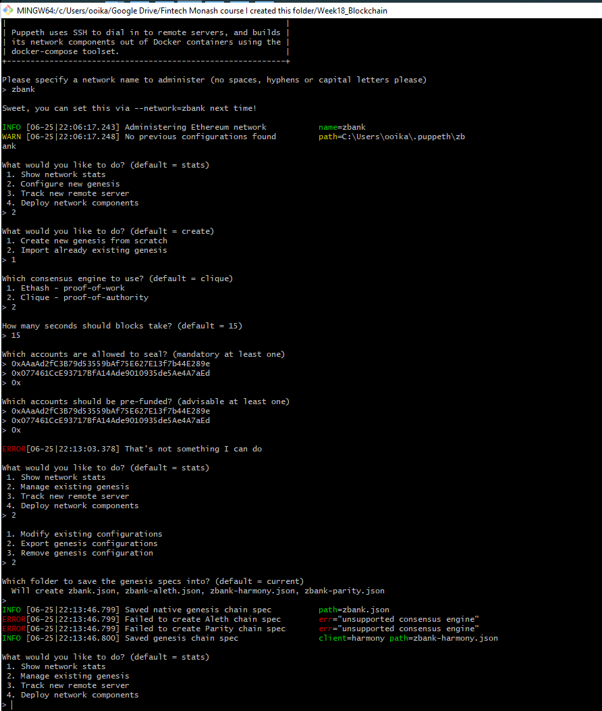
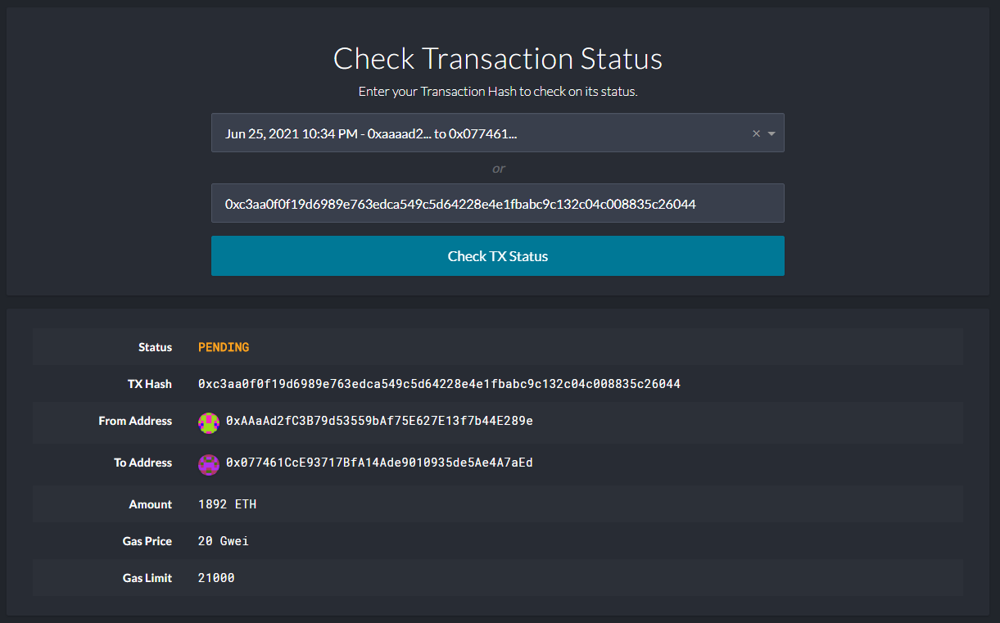
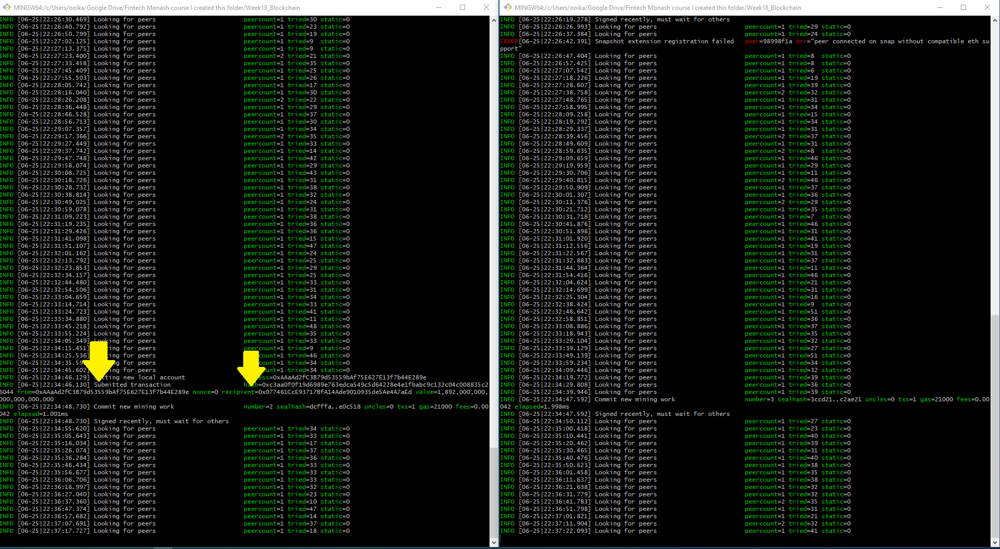
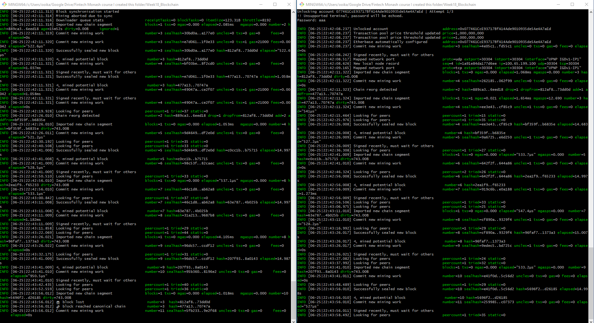
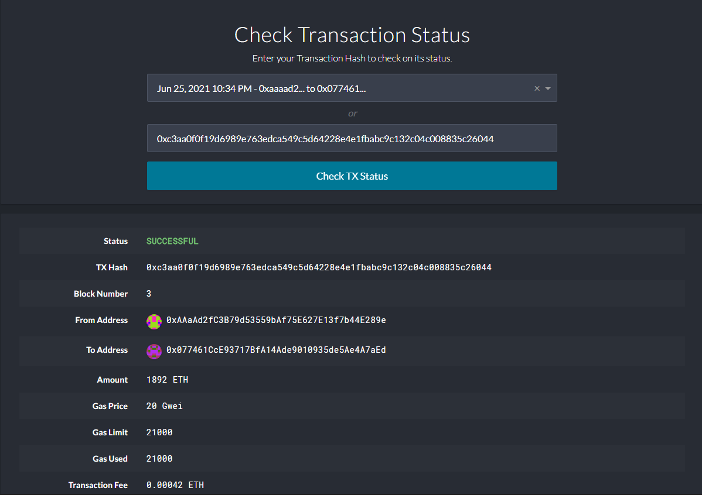

# Proof of Authority Development Chain for ZBank

The private blockchain network for ZBank has already been set up by myself, lead blockchain developer. This private network is running on the Ethereum network.

Preliminary setup information:  
1. New Python 3.7 virtual ethereum environment (conda create -n ethereum python=3.7 anaconda
)  
2. Activating the environment (conda activate ethereum)  
3. Download and install the web3.py module (pip install web3)  
4. Install the bit module (pip install bit)  
5. Installing MyCrypto Desktop App (https://download.mycrypto.com)
6. Installing Go Ethereum Tools (https://geth.ethereum.org/downloads/)

(Troubleshooting)  
Install Microsoft Visual C++ Build Tools In Windows  
In some cases, the Web3.py library may fail to install in Microsoft Windows due to the need for Microsoft Visual C++ Build Tools. In such an event, following the below steps to resolve the issue:  
Go to: https://visualstudio.microsoft.com/downloads/  
Scroll down the page and click on "Tools for Visual Studio 2019" to reveal the sub-options.  
Download the "Build Tools for Visual Studio 2019" package.  
Run the package file and select the C++ build tools option. Then click install.  
This process takes about 15 minutes

# Instructions

## Genesis block has been created with Puppeth. Refer to the configurations if needed

## Nodes 1 & 2 have already been initialised (created)
These 2 nodes can be used to begin mining blocks.  

Settings:  
node 1:
password = aaa  
Public address of the key:   0xAAaAd2fC3B79d53559bAf75E627E13f7b44E289e  
Path of the secret key file: node1\keystore\UTC--2021-06-25T12-02-38.956787700Z--aaaad2fc3b79d53559baf75e627e13f7b44e289e

node 2:
password = aaa  
Public address of the key:   0x077461CcE93717BfA14Ade9010935de5Ae4A7aEd  
Path of the secret key file: node2\keystore\UTC--2021-06-25T12-04-11.284441400Z--077461cce93717bfa14ade9010935de5ae4a7aed

puppeth network name:
zbank

chain/network ID:
888

blocktime:
15 seconds

## Running the nodes

Run the nodes in separate terminal windows with the commands:

./geth --datadir node1 --unlock "SEALER_ONE_ADDRESS" --mine --rpc --allow-insecure-unlock  
./geth --datadir node2 --unlock "SEALER_TWO_ADDRESS" --mine --port 30304 --bootnodes "enode://SEALER_ONE_ENODE_ADDRESS@127.0.0.1:30303" --ipcdisable --allow-insecure-unlock

* Run the first node, unlock the account, enable mining, add the RPC remote procedure call flag, only one node needs RPC enabled. In this case, sealer one address is the public key of node1 without the 0x. Hence the code to be put into the first terminal window is:  
./geth --datadir node1 --unlock "AAaAd2fC3B79d53559bAf75E627E13f7b44E289e" --mine --rpc --allow-insecure-unlock  

* For the 2nd terminal window, sealer two address is the public key of node2 without the 0x. Set a different peer port for the second node and use the first node's `enode` address as the `bootnode` flag. Hence the code to run is:  
./geth --datadir node2 --unlock "077461CcE93717BfA14Ade9010935de5Ae4A7aEd" --mine --port 30304 --bootnodes "enode://98f49f6282d6f37949edb62fd76b172c0ff9a163ca95a1a461dee7c718089ea6acfe247e3c7c0b395230e62a78f3f0a0e8ceeb5b581970642e8f36a8818d81a9@127.0.0.1:30303" --ipcdisable --allow-insecure-unlock

NOTE: Type your password (aaa) and hit enter - even if you can't see it visually!

## Send a test transaction

* Use the MyCrypto GUI wallet to connect to the node with the exposed RPC port.

* You will need to use a custom network, and include the chain ID (888 for this project), URL http://127.0.0.1:8545 and use ETH as the currency.

* Import the keystore file from the `node1/keystore` directory into MyCrypto. This will import the private key.

* Send a transaction from the `node1` account to the `node2` account. Initially, it will appear as 'pending'.  

* Looking back at the 2 opened terminals, you should see a 'submitted transaction' from the node 1 address to the node 2 address. In this case, even though there was a submitted transaction, our nodes were not mining or syncing properly, hence we had to interrupt the currently running command (Control + C). The 2 nodes were then restarted as per code above.  

* After the nodes were restarted, they synced and blocks were mined successfully.  

* Our transaction was successful. Usually the transaction would take only 15 seconds, which corresponds to our blocktime.  
